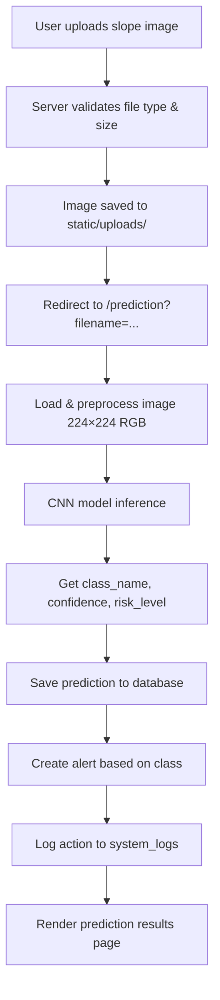
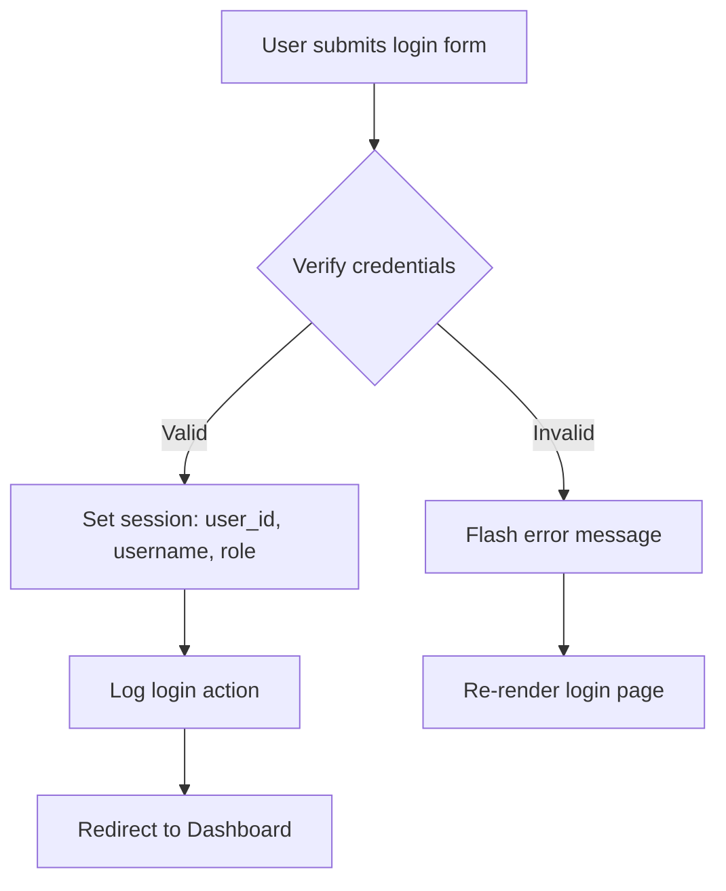

# 📄 Product Requirements Document (PRD)

## **AI Rockfall Prediction System — RockGuard AI**

| Field            | Detail                                                                 |
| ---------------- | ---------------------------------------------------------------------- |
| **Project Name** | AI-Based Rockfall Prediction and Alert System for Open Pit Mines       |
| **Version**      | 1.0.0                                                                  |
| **Created**      | July 2025                                                              |
| **Updated**      | July 2026                                                              |
| **Stack**        | Flask (Python) + Vite/React/TypeScript (Frontend) + TensorFlow/Keras   |
| **Target Users** | Mining Engineers, Safety Officers, Site Managers, Admin Personnel       |

---

## 1. Executive Summary

**RockGuard AI** is a web-based application that uses deep learning (Convolutional Neural Networks) to predict rockfall risk levels in open-pit mines from uploaded slope images. The system classifies mine slope images into three risk categories — **Safe**, **Warning**, and **Dangerous** — and provides real-time alerts, historical tracking, and reporting capabilities to support mine safety decision-making.

This is a **Final Year Engineering Project** designed to demonstrate how AI/ML can be applied to geological hazard prediction in the mining industry.

---

## 2. Problem Statement

Open-pit mines face constant risk of rockfall events that can cause injury, fatality, and operational downtime. Traditional visual inspection methods are:

- **Subjective** — dependent on the inspector's experience
- **Slow** — manual assessments take significant time
- **Inconsistent** — different inspectors may classify the same slope differently

RockGuard AI addresses these challenges by providing an **automated, consistent, and rapid** image-based risk classification system.

---

## 3. Goals & Objectives

| # | Objective                                                                    |
|---|------------------------------------------------------------------------------|
| 1 | Classify mine slope images into Safe / Warning / Dangerous in real-time      |
| 2 | Provide confidence scores and risk levels for each prediction                |
| 3 | Maintain a searchable history of all predictions                             |
| 4 | Generate daily, weekly, and monthly safety reports                           |
| 5 | Alert system that categorizes predictions and creates automatic notifications|
| 6 | Role-based access control (User / Admin)                                     |
| 7 | Admin panel for user management and system monitoring                        |
| 8 | Exportable prediction history (CSV)                                          |

---

## 4. Architecture Overview

The project has a **dual frontend** architecture:

```
┌─────────────────────────────────────────────────────────────────┐
│                     CLIENT LAYER                                │
│                                                                 │
│   ┌──────────────────────┐    ┌──────────────────────────────┐  │
│   │   Flask/Jinja2 SSR   │    │  Vite + React + TypeScript   │  │
│   │  (templates/*.html)  │    │     (src/pages/*.tsx)         │  │
│   │  Bootstrap 5 + CSS   │    │     TailwindCSS              │  │
│   │  Chart.js            │    │     Lucide React Icons        │  │
│   └──────────┬───────────┘    └──────────────┬───────────────┘  │
│              │                               │                  │
│              │ Server-rendered               │ Client-side SPA  │
│              │ (port 5000)                   │ (port 5173)      │
└──────────────┼───────────────────────────────┼──────────────────┘
               │                               │
┌──────────────┼───────────────────────────────┼──────────────────┐
│              ▼                               │                  │
│   ┌──────────────────────┐                   │                  │
│   │     Flask Backend    │◄──────────────────┘                  │
│   │     (app.py)         │                                      │
│   └──────────┬───────────┘                                      │
│              │                                                  │
│   ┌──────────▼───────────┐    ┌──────────────────────────────┐  │
│   │   SQLite Database    │    │   TensorFlow/Keras CNN       │  │
│   │   (database.db)      │    │   (model/rockfall_model.h5)  │  │
│   │   (database.py)      │    │   (model/predict.py)         │  │
│   └──────────────────────┘    └──────────────────────────────┘  │
│                      SERVER LAYER                               │
└─────────────────────────────────────────────────────────────────┘
```

### 4.1 Flask Backend (Primary — Production)

- Server-side rendered pages using Jinja2 templates
- Handles authentication, file uploads, predictions, and all business logic
- Serves the API endpoint (`/api/stats`)

### 4.2 React Frontend (Secondary — Development/Demo)

- Single-page application built with Vite + React + TypeScript
- Uses TailwindCSS for styling and Lucide React for icons
- Client-side state management via a custom `useApp()` hook
- Supabase integration configured (for potential cloud backend)

---

## 5. Technology Stack

### 5.1 Backend

| Technology        | Version  | Purpose                              |
|-------------------|----------|--------------------------------------|
| Python            | 3.x      | Core backend language                |
| Flask             | 3.1.3    | Web framework                        |
| Werkzeug          | 3.1.8    | WSGI utilities & password hashing    |
| Jinja2            | 3.1.6    | HTML templating engine               |
| SQLite            | Built-in | Lightweight relational database      |
| TensorFlow (CPU)  | 2.21.0   | Deep learning framework              |
| Keras             | 3.15.0   | High-level neural network API        |
| OpenCV            | 5.0.0    | Image processing                     |
| Pillow            | 12.3.0   | Image loading and manipulation       |
| scikit-learn      | 1.9.0    | ML utilities                         |
| NumPy             | 2.5.1    | Numerical computations               |
| Matplotlib        | 3.11.0   | Training visualization plots         |

### 5.2 Frontend (Flask Templates)

| Technology     | Version | Purpose                        |
|----------------|---------|--------------------------------|
| Bootstrap      | 5.3.3   | UI component framework         |
| Font Awesome   | 6.5.1   | Icon library                   |
| Chart.js       | 4.4.3   | Dashboard charts & graphs      |
| Custom CSS     | —       | Theme & styling (`style.css`)  |

### 5.3 Frontend (React SPA)

| Technology     | Version  | Purpose                         |
|----------------|----------|----------------------------------|
| React          | 18.3.1   | UI library                       |
| TypeScript     | 5.5.3    | Type-safe JavaScript             |
| Vite           | 5.4.2    | Build tool & dev server          |
| TailwindCSS    | 3.4.1    | Utility-first CSS framework      |
| Lucide React   | 0.344.0  | Icon library                     |
| Supabase JS    | 2.57.4   | Cloud database client (optional) |

---

## 6. Project Directory Structure

```
AI_ROCKFALL_PREDICTION_SYSTEMS/
│
├── app.py                      # Flask application entry point (312 lines)
├── database.py                 # SQLite database helpers (200 lines)
├── database.db                 # SQLite database file (auto-generated)
├── requirements.txt            # Python dependencies
├── .env                        # Environment variables (Supabase keys)
├── .gitignore                  # Git ignore rules
│
├── model/                      # ML Model Layer
│   ├── cnn_model.py            # CNN architecture definition (3-conv-layer Sequential)
│   ├── train_model.py          # Training script with data augmentation
│   ├── generate_model.py       # Synthetic data generator for demo model
│   ├── predict.py              # Inference/prediction utility
│   ├── plot_training.py        # Training accuracy/loss visualization
│   ├── rockfall_model.h5       # Trained Keras model weights (~150 KB)
│   ├── class_names.json        # ["Safe", "Warning", "Dangerous"]
│   └── training_history.json   # Training metrics per epoch
│
├── dataset/                    # Training Dataset
│   ├── Safe/                   # Safe slope images
│   ├── Warning/                # Warning slope images
│   └── Dangerous/              # Dangerous slope images
│
├── templates/                  # Jinja2 HTML Templates (Flask SSR)
│   ├── base.html               # Base layout (navbar, footer, flash messages)
│   ├── index.html              # Landing/home page
│   ├── login.html              # Login & registration page
│   ├── dashboard.html          # Dashboard with stats & charts
│   ├── upload.html             # Image upload page
│   ├── prediction.html         # Prediction results display
│   ├── history.html            # Prediction history with search
│   ├── reports.html            # Report generation (daily/weekly/monthly)
│   ├── settings.html           # User settings (threshold, sensitivity, theme)
│   ├── admin.html              # Admin panel (user mgmt, logs)
│   ├── mine_info.html          # Mine information page
│   ├── emergency.html          # Emergency contacts page
│   ├── documentation.html      # System documentation page
│   └── error.html              # Error page (403, 404, 500)
│
├── static/                     # Static Assets
│   ├── css/
│   │   ├── style.css           # Main stylesheet (~14 KB)
│   │   └── js/
│   │       ├── main.js         # Common JS utilities
│   │       └── dashboard.js    # Dashboard chart logic
│   ├── image/
│   │   └── logo.png            # Application logo
│   └── uploads/                # User-uploaded images (runtime)
│
├── src/                        # React SPA Source (Vite)
│   ├── App.tsx                 # Root app component with page routing
│   ├── main.tsx                # React entry point
│   ├── store.tsx               # Global state, Navbar & Footer components
│   ├── index.css               # TailwindCSS imports
│   ├── vite-env.d.ts           # Vite type declarations
│   └── pages/                  # React page components
│       ├── HomePage.tsx
│       ├── LoginPage.tsx
│       ├── DashboardPage.tsx
│       ├── UploadPage.tsx
│       ├── PredictionPage.tsx
│       ├── HistoryPage.tsx
│       ├── ReportsPage.tsx
│       ├── SettingsPage.tsx
│       ├── AdminPage.tsx
│       ├── MineInfoPage.tsx
│       ├── EmergencyPage.tsx
│       └── DocumentationPage.tsx
│
├── index.html                  # Vite SPA entry point
├── package.json                # Node.js dependencies
├── vite.config.ts              # Vite configuration
├── tsconfig.json               # TypeScript configuration
├── tsconfig.app.json           # App TypeScript config
├── tsconfig.node.json          # Node TypeScript config
├── tailwind.config.js          # TailwindCSS configuration
├── postcss.config.js           # PostCSS configuration
└── eslint.config.js            # ESLint configuration
```

---

## 7. Features & Functional Requirements

### 7.1 Authentication & Authorization

| Feature           | Description                                                |
|-------------------|------------------------------------------------------------|
| User Registration | New users can register with username, email, and password  |
| User Login        | Session-based authentication with hashed passwords         |
| Role-Based Access | Two roles: `user` (standard) and `admin` (elevated)        |
| Session Management| Flask server-side sessions                                 |
| Default Accounts  | Auto-seeded on first run: `admin/admin123`, `user/user123` |

### 7.2 Image Upload & Prediction

| Feature              | Description                                                    |
|----------------------|----------------------------------------------------------------|
| File Upload          | Accepts PNG, JPG, JPEG images (max 16 MB)                      |
| Image Preprocessing  | Resize to 224×224, normalize pixels to [0, 1]                  |
| CNN Inference        | 3-class softmax output: Safe / Warning / Dangerous             |
| Confidence Score     | Percentage confidence for the predicted class                  |
| Risk Level Mapping   | Safe → Low, Warning → Medium, Dangerous → High                |
| Prediction Time      | Inference duration in seconds                                  |
| Probability Breakdown| Full probability distribution across all 3 classes             |
| Auto Alert Generation| Alerts created automatically based on prediction class         |

### 7.3 Dashboard

| Feature           | Description                                         |
|-------------------|-----------------------------------------------------|
| Stats Cards       | Total predictions, Safe/Warning/Dangerous counts    |
| Trend Chart       | Last 7 days prediction trend (Chart.js)             |
| Alert Counter     | Total active alerts                                 |

### 7.4 Prediction History

| Feature        | Description                                            |
|----------------|--------------------------------------------------------|
| List View      | All past predictions with metadata                     |
| Search/Filter  | Search by image name, prediction class, or risk level  |
| Delete Record  | Remove individual prediction records                   |
| CSV Export      | Download full history as CSV file                      |

### 7.5 Reporting

| Feature          | Description                                          |
|------------------|------------------------------------------------------|
| Report Types     | Daily, Weekly, Monthly                               |
| Report Metrics   | Total, Safe, Warning, Dangerous counts + accuracy    |
| Saved Reports    | Reports are persisted in the database                |

### 7.6 Admin Panel

| Feature          | Description                                          |
|------------------|------------------------------------------------------|
| User Management  | View, create, and delete users                       |
| Role Assignment  | Assign user or admin roles                           |
| System Logs      | View recent system activity (login, upload, predict) |
| All Predictions  | View all users' predictions                          |
| All Reports      | View all generated reports                           |

### 7.7 Settings

| Feature             | Description                                     |
|---------------------|-------------------------------------------------|
| Risk Threshold      | Configurable confidence threshold (default: 70%)|
| Sensitivity Level   | Low / Medium / High sensitivity setting          |
| Theme Selection     | Dark / Light theme toggle                        |

### 7.8 Informational Pages

| Page          | Description                                              |
|---------------|----------------------------------------------------------|
| Home          | Landing page with project overview and features          |
| Mine Info     | Details about open-pit mining and rockfall risks         |
| Emergency     | Emergency contact numbers and protocols                  |
| Documentation | System documentation and user guide                      |

---

## 8. Database Schema (SQLite)

### 8.1 `users`

| Column        | Type    | Constraints                         |
|---------------|---------|-------------------------------------|
| id            | INTEGER | PRIMARY KEY AUTOINCREMENT           |
| username      | TEXT    | UNIQUE NOT NULL                     |
| email         | TEXT    | UNIQUE NOT NULL                     |
| password_hash | TEXT    | NOT NULL (Werkzeug bcrypt hash)     |
| role          | TEXT    | NOT NULL DEFAULT 'user'             |
| created_at    | TEXT    | NOT NULL                            |

### 8.2 `predictions`

| Column          | Type    | Constraints                       |
|-----------------|---------|-----------------------------------|
| id              | INTEGER | PRIMARY KEY AUTOINCREMENT         |
| user_id         | INTEGER | NOT NULL, FK → users(id)          |
| image_name      | TEXT    | NOT NULL                          |
| image_path      | TEXT    | NOT NULL                          |
| prediction      | TEXT    | NOT NULL (Safe/Warning/Dangerous) |
| confidence      | REAL    | NOT NULL                          |
| risk_level      | TEXT    | NOT NULL (Low/Medium/High)        |
| prediction_time | REAL    | Inference time in seconds         |
| created_date    | TEXT    | NOT NULL (YYYY-MM-DD)             |
| created_time    | TEXT    | NOT NULL (HH:MM:SS)              |

### 8.3 `alerts`

| Column        | Type    | Constraints                             |
|---------------|---------|-----------------------------------------|
| id            | INTEGER | PRIMARY KEY AUTOINCREMENT               |
| prediction_id | INTEGER | NOT NULL, FK → predictions(id)          |
| alert_type    | TEXT    | NOT NULL (safe/warning/danger)          |
| message       | TEXT    | NOT NULL                                |
| created_date  | TEXT    | NOT NULL                                |
| created_time  | TEXT    | NOT NULL                                |

### 8.4 `reports`

| Column            | Type    | Constraints                        |
|-------------------|---------|------------------------------------|
| id                | INTEGER | PRIMARY KEY AUTOINCREMENT          |
| user_id           | INTEGER | NOT NULL, FK → users(id)           |
| report_type       | TEXT    | NOT NULL (daily/weekly/monthly)    |
| start_date        | TEXT    | NOT NULL                           |
| end_date          | TEXT    | NOT NULL                           |
| total_predictions | INTEGER | NOT NULL                           |
| safe_count        | INTEGER | NOT NULL                           |
| warning_count     | INTEGER | NOT NULL                           |
| danger_count      | INTEGER | NOT NULL                           |
| accuracy          | REAL    | NOT NULL                           |
| created_at        | TEXT    | NOT NULL                           |

### 8.5 `system_logs`

| Column     | Type    | Constraints               |
|------------|---------|---------------------------|
| id         | INTEGER | PRIMARY KEY AUTOINCREMENT |
| user_id    | INTEGER | Nullable                  |
| action     | TEXT    | NOT NULL                  |
| details    | TEXT    | Nullable                  |
| created_at | TEXT    | NOT NULL                  |

---

## 9. API Routes (Flask)

### 9.1 Public Routes

| Method | Route            | Description              |
|--------|------------------|--------------------------|
| GET    | `/`              | Home / Landing page      |
| GET    | `/mine-info`     | Mine information page    |
| GET    | `/emergency`     | Emergency contacts page  |
| GET    | `/documentation` | Documentation page       |

### 9.2 Authentication Routes

| Method   | Route       | Description                       |
|----------|-------------|-----------------------------------|
| GET/POST | `/login`    | Login page & authentication       |
| GET/POST | `/register` | Registration page & user creation |
| GET      | `/logout`   | Clear session & redirect          |

### 9.3 Protected Routes (login required)

| Method   | Route                         | Description                      |
|----------|-------------------------------|----------------------------------|
| GET      | `/dashboard`                  | Dashboard with stats & charts    |
| GET/POST | `/upload`                     | Image upload page                |
| GET      | `/prediction?filename=...`    | Run prediction & show results    |
| GET      | `/history`                    | Prediction history list          |
| POST     | `/history/delete/<pred_id>`   | Delete a prediction record       |
| GET      | `/history/export`             | Export history as CSV            |
| GET/POST | `/reports`                    | Generate & view reports          |
| GET/POST | `/settings`                   | User settings page               |
| GET      | `/api/stats`                  | JSON API for dashboard stats     |

### 9.4 Admin Routes (admin role required)

| Method | Route                            | Description            |
|--------|----------------------------------|------------------------|
| GET    | `/admin`                         | Admin dashboard        |
| POST   | `/admin/delete_user/<user_id>`   | Delete a user          |
| POST   | `/admin/create_user`             | Create a new user      |

### 9.5 Error Handlers

| Code | Route    | Description             |
|------|----------|-------------------------|
| 403  | —        | Access forbidden         |
| 404  | —        | Page not found           |
| 500  | —        | Internal server error    |

---

## 10. Machine Learning Pipeline

### 10.1 Model Architecture (CNN)

```
Model: "rockfall_cnn" (Sequential)
─────────────────────────────────────────────────
Layer                    Output Shape    Params
═════════════════════════════════════════════════
Input                    (224, 224, 3)   0
Conv2D (16, 3×3, ReLU)   (224, 224, 16)  448
MaxPooling2D (2×2)       (112, 112, 16)  0
Conv2D (32, 3×3, ReLU)   (112, 112, 32)  4,640
MaxPooling2D (2×2)       (56, 56, 32)    0
Conv2D (64, 3×3, ReLU)   (56, 56, 64)    18,496
MaxPooling2D (2×2)       (28, 28, 64)    0
GlobalAveragePooling2D   (64)            0
Dropout (0.3)            (64)            0
Dense (64, ReLU)         (64)            4,160
Dense (3, Softmax)       (3)             195
═════════════════════════════════════════════════
Total params: 27,939
```

### 10.2 Training Configuration

| Parameter          | Value                                   |
|--------------------|-----------------------------------------|
| Optimizer          | Adam (lr = 1e-3)                        |
| Loss Function      | Categorical Cross-Entropy               |
| Metrics            | Accuracy                                |
| Batch Size         | 32                                      |
| Epochs             | 30 (with EarlyStopping, patience=5)     |
| LR Scheduler       | ReduceLROnPlateau (factor=0.5, patience=3) |
| Validation Split   | 20%                                     |
| Data Augmentation  | Rotation ±20°, Shift ±15%, Flip, Zoom ±15%, Shear ±10% |
| Input Size         | 224 × 224 × 3 (RGB)                     |

### 10.3 Classification Classes

| Class       | Risk Level | Alert Type | Alert Message                    |
|-------------|------------|------------|----------------------------------|
| Safe        | Low        | safe       | No immediate risk detected.      |
| Warning     | Medium     | warning    | Possible rockfall detected.      |
| Dangerous   | High       | danger     | Immediate evacuation required.   |

### 10.4 Synthetic Data Generator

For demonstration purposes, `generate_model.py` creates procedural mine slope texture images:
- **Safe**: Light grey tones, smooth surfaces, minimal cracks
- **Warning**: Brown earth tones, moderate texturing, visible crack lines
- **Dangerous**: Dark tones, heavy texturing, many fracture lines and debris

Generates 30 samples per class at 224×224 resolution, trains a smaller model (64×64 input, 8 epochs).

---

## 11. Non-Functional Requirements

| Requirement      | Specification                                          |
|------------------|--------------------------------------------------------|
| **Performance**  | Prediction inference < 2 seconds per image             |
| **File Limits**  | Max upload: 16 MB, Formats: PNG/JPG/JPEG               |
| **Security**     | Password hashing (Werkzeug), Session-based auth         |
| **Database**     | SQLite (file-based, zero-config)                        |
| **Portability**  | Runs on Windows/Linux/macOS with Python 3.x            |
| **Scalability**  | Single-server design (suitable for project demo)        |
| **Browser**      | Modern browsers (Chrome, Firefox, Edge, Safari)        |

---

## 12. Default Credentials

| Role  | Username | Password   |
|-------|----------|------------|
| Admin | admin    | admin123   |
| User  | user     | user123    |

> ⚠️ **Change these credentials in production environments.**

---

## 13. How to Run (Localhost)

### 13.1 Prerequisites

- **Python 3.10+** installed
- **Node.js 18+** and **npm** installed (only for React frontend)
- **pip** package manager

### 13.2 Option A: Run Flask Backend (Primary — Recommended)

```bash
# Step 1: Navigate to the project directory
cd c:\Users\PC\OneDrive\AI_ROCKFALL_PREDICTION_SYSTEMS

# Step 2: Create and activate a virtual environment
python -m venv .venv
.venv\Scripts\activate

# Step 3: Install Python dependencies
pip install -r requirements.txt

# Step 4: (Optional) Generate the model if rockfall_model.h5 doesn't exist or is invalid
python model/generate_model.py

# Step 5: Run the Flask server
python app.py
```

**Access the app at:** [http://localhost:5000](http://localhost:5000)

### 13.3 Option B: Run React Frontend (Secondary — Demo/Development)

```bash
# Step 1: Navigate to the project directory
cd c:\Users\PC\OneDrive\AI_ROCKFALL_PREDICTION_SYSTEMS

# Step 2: Install Node.js dependencies
npm install

# Step 3: Start the Vite dev server
npm run dev
```

**Access the React SPA at:** [http://localhost:5173](http://localhost:5173)

### 13.4 Run Both Simultaneously (Full Stack)

Open **two terminals**:

**Terminal 1 — Flask Backend:**
```bash
cd c:\Users\PC\OneDrive\AI_ROCKFALL_PREDICTION_SYSTEMS
.venv\Scripts\activate
python app.py
```

**Terminal 2 — React Frontend:**
```bash
cd c:\Users\PC\OneDrive\AI_ROCKFALL_PREDICTION_SYSTEMS
npm run dev
```

---

## 14. Key Workflows

### 14.1 Prediction Workflow



### 14.2 Authentication Workflow



---

## 15. Future Enhancements

| # | Enhancement                                                       |
|---|-------------------------------------------------------------------|
| 1 | Real-time camera/drone feed integration for continuous monitoring  |
| 2 | Transfer learning with pre-trained models (ResNet, EfficientNet)  |
| 3 | Geospatial mapping of prediction zones (GIS integration)          |
| 4 | Push notifications (email/SMS) for danger alerts                  |
| 5 | Multi-mine support with separate dashboards                       |
| 6 | PostgreSQL/MySQL for production-grade database                    |
| 7 | REST API with JWT authentication for mobile app integration       |
| 8 | Model versioning and A/B testing                                  |
| 9 | Larger, real-world dataset training for higher accuracy            |
| 10| Deployment on cloud (AWS/GCP/Azure) with CI/CD pipeline           |

---

## 16. License & Acknowledgements

This project is developed as a **Final Year Engineering Project** (© 2025).

Built with:
- [Flask](https://flask.palletsprojects.com/) — Python web framework
- [TensorFlow](https://www.tensorflow.org/) — ML framework
- [Bootstrap 5](https://getbootstrap.com/) — CSS framework
- [Chart.js](https://www.chartjs.org/) — JavaScript charting
- [React](https://react.dev/) — UI library
- [Vite](https://vitejs.dev/) — Frontend build tool
